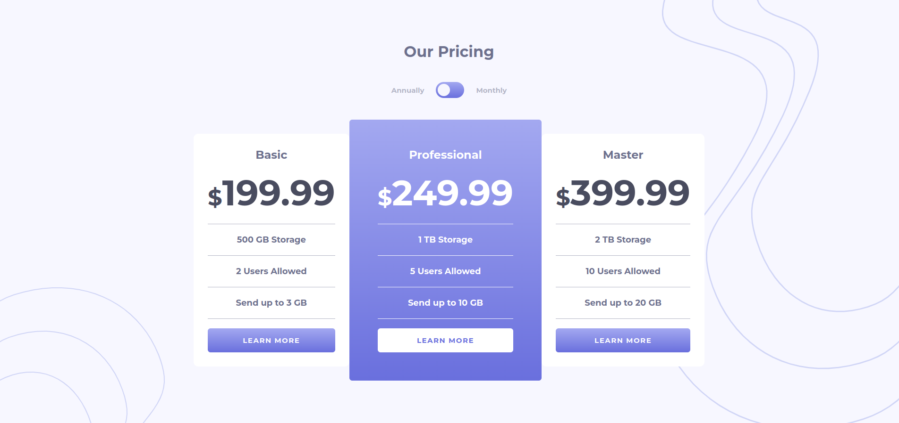
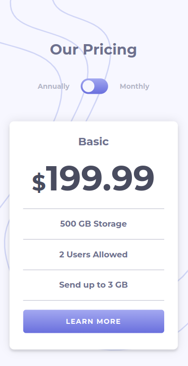

# Frontend Mentor - Pricing component with toggle solution

This is a solution to the [Pricing component with toggle challenge on Frontend Mentor](https://www.frontendmentor.io/challenges/pricing-component-with-toggle-8vPwRMIC). Frontend Mentor challenges help you improve your coding skills by building realistic projects. 

## Table of contents

- [Overview](#overview)
  - [The challenge](#the-challenge)
  - [Screenshot](#screenshot)
  - [Links](#links)
- [My process](#my-process)
  - [Built with](#built-with)
  - [Code Snippets](#code-snippets-and-learnings)
  - [Useful resources](#useful-resources)
- [Author](#author)


## Overview

### The challenge

Users should be able to:

- View the optimal layout for the component depending on their device's screen size

### Screenshot

 


### Links

- Solution URL: [frontendmentor](https://your-solution-url.com)
- Live Site URL: [visit](https://cipivlad.github.io/pricing_components/)

## My process

### Built with

- Mobile-first workflow
- Semantic HTML5 markup
- SCSS 
- Flexbox
- CSS Grid
- [React](https://react.dev/) - JS library
- Typescript
- Browsers: Google Chrome, Firefox

### Code Snippets and learnings

#### really enjoyed this workflow: instead of filling up html with lots of content
##### 1.  created "pricing.model.ts" with type alias as a model
```js

export type PricingModel = {
    mode: string,
    monthly: string,
    yearly: string,
    storage: string,
    users: string,
    send: string
}

export const basic: PricingModel = {
    mode: 'Basic',
    monthly: '19.99',
    yearly: '199.99',
    storage: '500 GB Storage',
    users: '2 Users Allowed',
    send: 'Send up to 3 GB'
} 

export const professional: PricingModel = { ...}

export const master:PricingModel = {...}

```
##### 2. made a price card comopnent from where content will be passed as props to parent component
```js

import { PricingModel } from "../models/pricing.model"

type ToggleProps = {
    toggle: boolean
}

const PriceCard = (props: PricingModel & ToggleProps) => {
    return (
        <div className="price_card_container ">
            <h2>{props.mode}</h2>
            <p><span>$</span>{props.toggle ? props.monthly : props.yearly}</p>
            <div className="price_description">
                <div className="line"></div>
                <p>{props.storage}</p>
                <div className="line"></div>
                <p>{props.users}</p>
                <div className="line"></div>
                <p>{props.send}</p>
                <div className="line"></div>
            </div>
            <a href="#">LEARN MORE</a>
        </div>
    )
}
export default PriceCard

```

##### 3. conditionally render PriceCard with spread operator 
```js
import '../scss/PriceList.scss'
import PriceCard from "./PriceCard"
import { basic, master, professional } from "../models/pricing.model"


type Props = {
    toggle: boolean
}

const PriceList = ({ toggle }: Props) => {

    return (
        <div className="price_list_container">
            {/* conditionally render a PriceCard component.
             If the basic variable is truthy, 
             the PriceCard component will be rendered with the basic object spread into its props, 
             along with the toggle prop. */}
            {basic && <PriceCard {...basic} toggle={toggle} />}
            {professional && <PriceCard {...professional} toggle={toggle} />}
            {master && <PriceCard {...master} toggle={toggle} />}
        </div>
    )
}
export default PriceList
```


```css

h2 ~ p > span {
  font-size: xxx-large;
}

```

### Useful resources

- [CSS Selectors](https://www.w3schools.com/cssref/css_selectors.php) - This helped me for using "~" and "<". I really liked this pattern because it allowed me to select nested elements and be specific
- [SVG Comonents in React](https://css-tricks.com/creating-ui-components-in-svg/) - This is an amazing article which helped me finally understand XYZ. I'd recommend it to anyone still learning this concept.
- [config vite for deploying github pages](https://vitejs.dev/guide/static-deploy#github-pages)


## Author

- Website - [Portfolio](https://cipivlad.github.io/myportfoliosite/)
- Frontend Mentor - [@CipiVlad](https://www.frontendmentor.io/profile/CipiVlad)
- DEV.to [https://dev.to/cipivlad](https://dev.to/cipivlad)

## Tags

#react, #scss, #typescript, #github-pages, #vite
